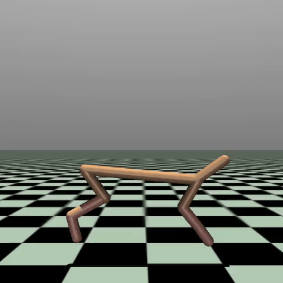

# MAML for HalfCheetah Backward Locomotion

A PyTorch implementation of Model-Agnostic Meta-Learning (MAML) applied to the HalfCheetah backward locomotion task using MuJoCo.

## Overview

This project implements MAML to train a policy that can quickly adapt to make a HalfCheetah robot run backward. 


### Result
The training produces an evaluation video (`Final_Evaluation.mp4`) showing the trained HalfCheetah agent performing backward locomotion.




### Environment
```python
class HalfCheetahBackward(gym.Env):
    def step(self, action):
        # Reward backward movement, penalize forward movement
        reward = -1 * info["reward_forward"] + 0.05 * info["reward_ctrl"]
```


### Meta-Learning Loop
1. Sample task batch
2. Inner adaptation: compute gradients and update policy copy
3. Query evaluation: test adapted policy performance  
4. Outer update: meta-parameter update using query losses

ium installation

### Performance Tips
- Use GPU acceleration when available
- Monitor training curves for early stopping
- Adjust hyperparameters for your hardware

## References

- [Model-Agnostic Meta-Learning (MAML)](https://arxiv.org/abs/1703.03400)
- [Gymnasium Documentation](https://gymnasium.farama.org/)
- [MuJoCo Physics Engine](https://mujoco.org/)

